# 基于Flutter的安卓开发学习移动应用软件软件设计说明书

## 1 引言

### 1.1 编写目的
本说明书用于描述 基于Flutter的安卓开发学习移动应用软件 的整体结构、功能组成、页面设计、数据组织、接口接入方式以及运行部署方案，为软件著作权登记、后续版本维护与教学演示提供完整的技术文档依据。

### 1.2 软件范围
本软件是一套面向 Android 终端运行的 Flutter 学习型移动应用，通过统一首页组织多个实验模块，覆盖基础组件展示、交互处理、页面导航、状态管理、异步加载和硬件能力接入等内容。系统不依赖远程业务后端，重点体现移动端页面实现与设备能力调用。

### 1.3 参考环境
- 开发环境：Microsoft Windows 10 家庭版，Intel(R) Core(TM) Ultra 9 285H，内存约 31.5GB
- 开发工具：Flutter 3.41.6，Dart 3.11.4，Android SDK，ADB
- 运行平台：Android 16，Android 7.0 及以上版本
- 应用包名：`com.example.flutter_dudo`
- 版本号：`V1.0.0`

## 2 需求分析

### 2.1 建设目标
系统建设目标是提供一套可直接安装到安卓真机中的 Flutter 学习应用，使学习者能够通过点击式交互观察各类组件的实际效果，并结合内置代码片段快速建立“知识点 - 页面结构 - 状态变化 - 设备能力”之间的映射关系。与单纯文档型教程相比，本软件更强调真机操作和可视化反馈。

### 2.2 目标用户
- Flutter 初学者：需要快速理解常见组件、页面跳转和状态管理方式。
- 移动应用教学人员：需要一套可展示、可安装、可演示的课堂案例。
- Android 实验学习人员：需要观察定位、传感器、相机、文件与蓝牙等接口的调用方式。

### 2.3 功能需求
软件应满足以下需求：一是提供统一首页作为模块导航入口；二是每个模块需要同时给出场景说明、可调参数提示、关键代码片段和运行效果区；三是支持文本显示、布局排版、按钮交互、表单输入、消息反馈、页面导航、状态提升、主题切换和异步列表等基础实验；四是支持 GPS、传感器、相机、文件读取与蓝牙扫描等硬件能力演示；五是支持 Android 真机安装运行，并在真实设备上完成页面展示与功能触发。

### 2.4 非功能需求
系统需要保证界面结构清晰、操作路径简单、真机运行稳定、权限申请符合 Android 平台规范、页面切换响应及时、代码结构易于阅读与二次扩展。同时，文档和演示内容要保持一致，便于教学与软著材料复用。

## 3 系统概述

### 3.1 系统定位
本系统属于移动端教学演示软件，采用“首页导航 + 专题模块 + 硬件子模块”的结构组织学习内容。所有功能均以内置页面形式运行，适合作为 Flutter 基础到进阶能力的串联式学习工具。

### 3.2 首页结构
首页展示全部模块入口，用户可通过列表卡片进入任意学习专题。首页同时承担模块总览、知识点分发和统一跳转控制作用。

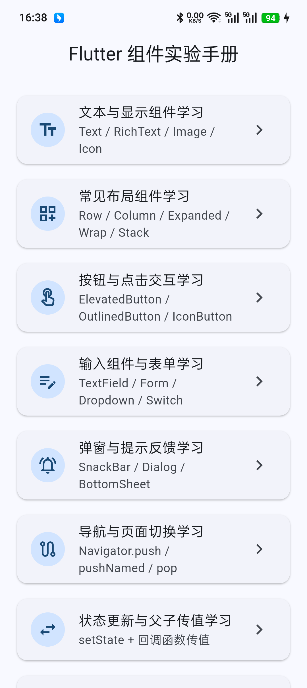

图 4-2 页面展示了首页模块列表，卡片式入口使文本显示、布局、按钮、表单、导航、主题、异步加载和硬件学习等内容集中呈现，便于学习者按主题逐项操作。

## 4 总体设计

### 4.1 用例设计
从使用过程看，用户首先打开应用并进入首页，然后根据学习目标选择具体模块，查看场景说明、阅读关键代码、观察运行效果，并可在部分模块中调整参数、触发跳转或调用硬件能力。

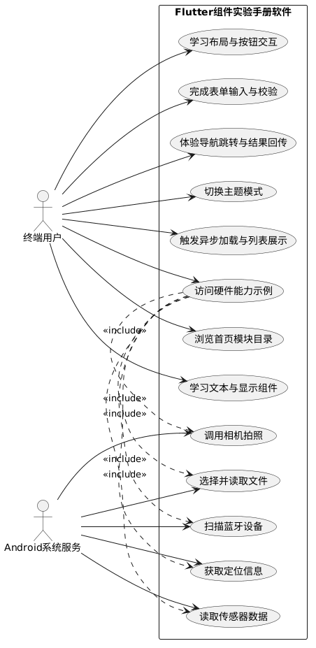

### 4.2 架构设计
系统整体采用 Flutter 单端架构。应用启动后由 `main.dart` 进入根组件 `FlutterWidgetLabApp`，根组件负责初始化主题模式、MaterialApp 和命名路由。页面层通过 `HomePage` 统一组织模块入口，各学习页面复用 `DemoPageTemplate` 形成一致的说明区、代码区和运行区布局。硬件模块通过插件桥接 Android 原生能力，实现定位、传感器、相机、文件和蓝牙能力调用。

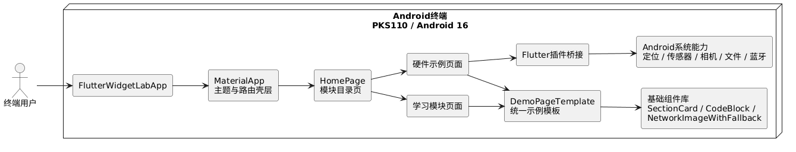

### 4.3 部署设计
应用以 Android 安装包形式部署到移动终端。开发阶段在 Windows 主机上完成 Flutter 编译与 ADB 真机调试，运行阶段依赖 Android 系统服务和对应硬件权限。

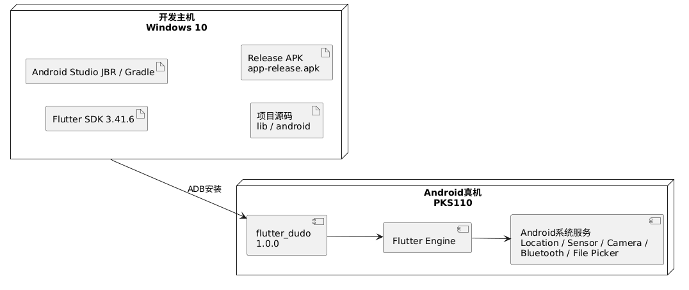

### 4.4 模块划分
系统功能按照教学内容划分为基础组件模块、交互模块、数据与状态模块、主题模块、异步模块和硬件模块六大类。其中：
- 基础组件模块包括文本显示、布局演示和按钮交互。
- 交互模块包括表单输入、消息反馈和导航跳转。
- 数据与状态模块包括状态提升和异步列表。
- 主题模块负责样式切换与统一视觉展示。
- 硬件模块包括 GPS、传感器、相机、文件读取和蓝牙扫描五类示例。

## 5 详细设计

### 5.1 通用页面模板设计
所有学习页面均基于 `DemoPageTemplate` 构建，模板分为四个层次：使用场景说明区、参数调整建议区、关键代码展示区和运行效果区。该设计使各模块拥有一致的信息组织方式，学习者可快速定位“为什么使用”“如何调整”“关键实现”和“实际效果”四类核心信息。

### 5.2 表单输入模块设计
表单输入页面使用 `Form`、`TextFormField`、`DropdownButtonFormField`、`CheckboxListTile` 和 `FilledButton` 组合构建。页面内部通过 `GlobalKey<FormState>` 管理校验状态，通过 `TextEditingController` 保存姓名字段值，并在提交按钮触发时完成校验、协议勾选判断、结果更新和 SnackBar 提示。

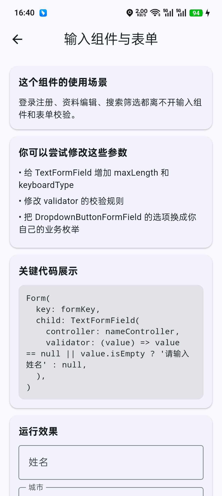

该模块体现了 Flutter 表单类组件的常见使用模式，适用于登录、注册、资料录入和筛选条件填写等业务场景。

### 5.3 导航模块设计
导航模块通过两个按钮分别演示 `Navigator.push` 与 `Navigator.pushNamed`。页面状态中保存返回结果文本，子页面返回后立即更新展示结果。该设计直观体现了页面间的参数传递与结果回传机制。

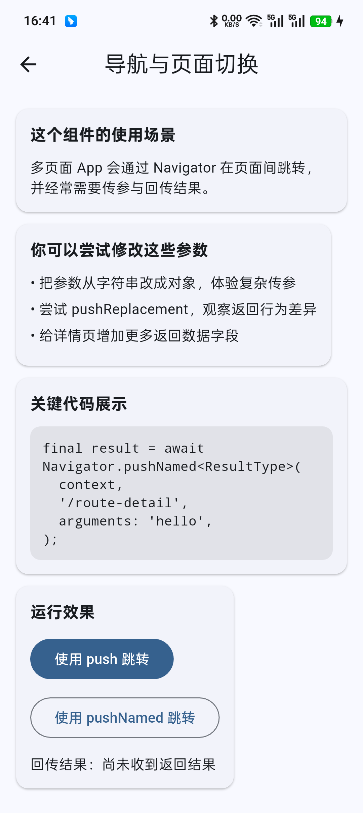

路由详情页面负责接收来自上级页面的字符串参数，并通过自定义结果对象将来源信息和时间戳返回给导航页面。

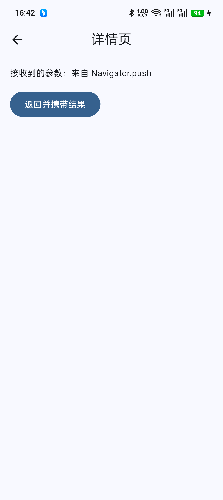

页面跳转主流程如下图所示。

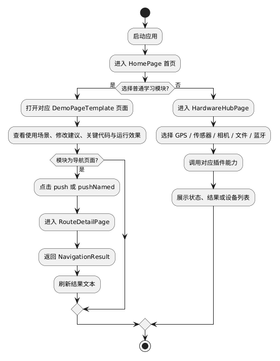

### 5.4 主题模块设计
主题模块通过 `ThemeMode` 控制浅色和深色两套主题配置，由根组件统一持有当前模式。学习页面通过 `SegmentedButton` 发出模式切换动作，再由根组件更新 `MaterialApp` 的 `themeMode`，从而使整个应用在无需重建路由的情况下完成统一样式切换。

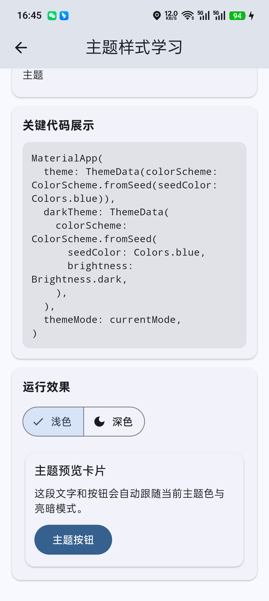

该模块适合演示全局色彩、组件视觉一致性和亮暗模式适配策略。

### 5.5 硬件能力入口设计
硬件入口页面作为二级目录，集中列出 GPS、传感器、相机、文件和蓝牙五类能力模块。该页面自身不处理复杂业务逻辑，主要承担硬件示例分发、页面跳转和学习路径组织的职责。

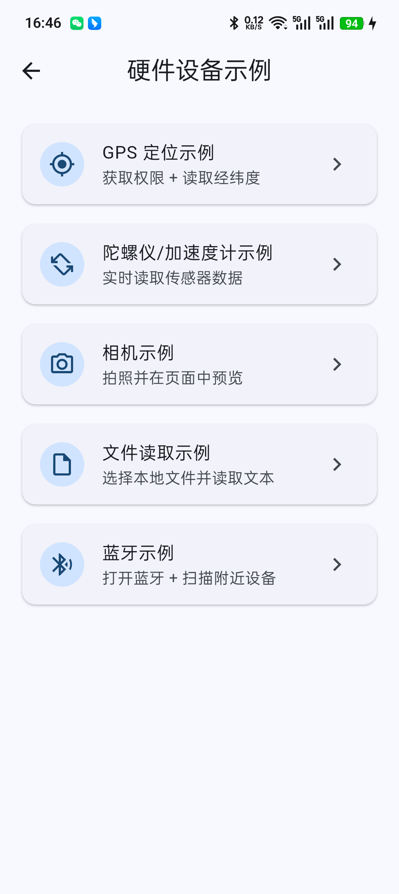

### 5.6 GPS 定位模块设计
GPS 模块首先检查系统定位服务是否开启，然后校验并申请定位权限，最后调用 `Geolocator.getCurrentPosition` 读取位置信息。若系统定位未开启或权限被拒绝，则页面会通过状态文本提示用户进行处理。该设计覆盖了移动端定位调用中“服务可用性检查、权限检查、位置读取、异常提示”四个关键环节。

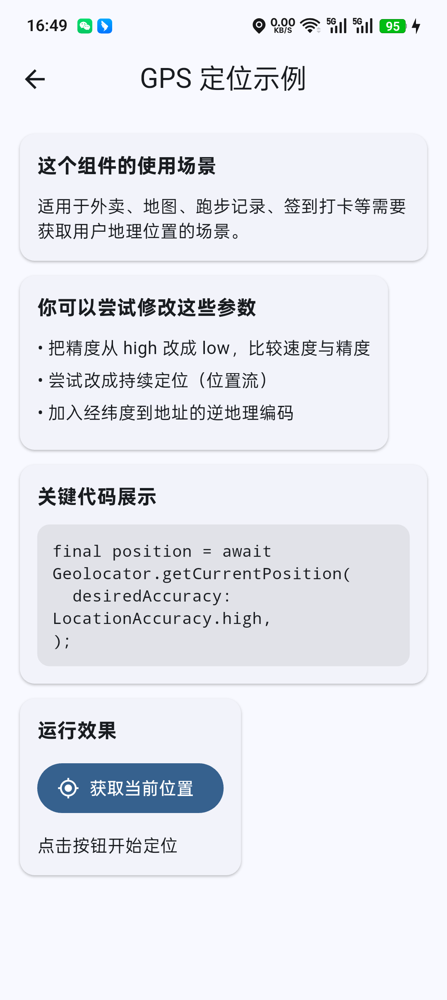

### 5.7 传感器模块设计
传感器模块分别订阅陀螺仪和加速度计事件流，并将最新值实时渲染到界面中。页面提供“开始监听”和“停止监听”两个按钮，对应启动和取消 `StreamSubscription`。这一设计体现了 Flutter 中基于流的异步硬件数据监听模式。

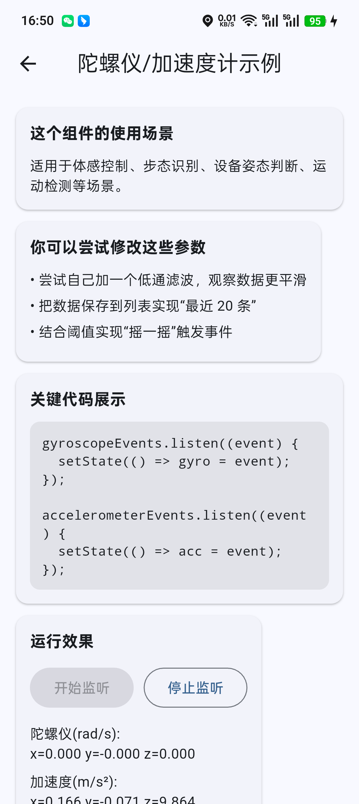

运行结果页面在监听开始后持续刷新角速度与加速度数值，便于学习者观察真实设备姿态变化。

### 5.8 相机模块设计
相机模块通过 `image_picker` 调起系统相机，完成拍照后回传图片路径，并在页面中使用 `Image.file` 预览拍摄结果。若用户取消拍照或调用失败，页面会使用状态字符串给出结果反馈。这一模块适合扩展为头像上传、现场取证、工单拍照等移动端业务。

### 5.9 文件读取模块设计
文件模块通过 `file_picker` 选择本地 `txt`、`json`、`md` 文件，再通过 Dart 文件 API 读取文本内容，并在页面中展示截断后的预览结果。模块逻辑覆盖“文件选择、路径校验、文本读取、结果展示和异常处理”完整流程。

### 5.10 蓝牙模块设计
蓝牙模块调用 `flutter_blue_plus` 开启蓝牙并执行定时扫描，将扫描得到的 `ScanResult` 集合实时更新到页面列表中。模块输出包含设备名称、设备标识和 RSSI 信号强度，可作为连接外设、设备发现和近场通信实验的基础。

### 5.11 其他基础模块设计
文本显示模块主要演示 `Text`、`RichText`、图标、头像和网络图片异常兜底；布局模块重点展示 `Row`、`Expanded`、`Wrap`、`Stack` 的组合用法；按钮模块演示 `ElevatedButton`、`OutlinedButton`、`TextButton`、`IconButton` 与 `FilledButton` 的差异化交互；反馈模块用于演示 `SnackBar`、`AlertDialog` 和 `BottomSheet` 三类反馈组件；状态提升模块通过父子组件回调传值演示单向数据流；异步列表模块通过 `FutureBuilder` 演示等待态、错误态和结果态切换。上述模块共同构成从组件基础到页面交互的完整学习链路。

## 6 数据设计

### 6.1 状态数据设计
本系统不依赖外部数据库，数据设计以页面内状态对象和插件返回数据为主。核心状态包括：
- 主题状态：`ThemeMode`，用于控制浅色与深色主题。
- 表单状态：姓名字符串、城市选项、协议勾选值、提交结果文本。
- 导航状态：路由参数字符串与 `NavigationResult` 返回对象。
- 异步状态：Future 列表对象、错误模拟开关。
- 硬件状态：定位结果文本、传感器当前值、照片文件路径、文件预览文本、蓝牙扫描结果集合。

### 6.2 数据结构设计
系统采用轻量级本地状态存储方式，通过 `StatefulWidget` 成员变量、控制器对象和事件回调保存运行态数据。导航模块引入 `NavigationResult` 作为返回数据模型，用于规范来源和时间信息的传递结构。

### 6.3 类关系设计
页面组件、模板组件和结果模型之间的关系如下图所示。

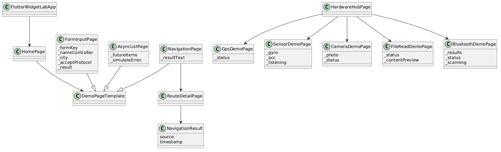

## 7 接口设计

### 7.1 页面内部接口
- `onThemeModeChanged(ThemeMode mode)`：主题页面通知根组件切换主题模式。
- `onAdd()` / `onMinus()`：状态提升模块中子组件通知父组件变更数值。
- `Navigator.push` / `Navigator.pushNamed`：负责页面间路由跳转。
- `Navigator.pop(result)`：负责从详情页回传处理结果。

### 7.2 插件接口
- `Geolocator.isLocationServiceEnabled`、`Geolocator.checkPermission`、`Geolocator.getCurrentPosition`：定位能力接口。
- `gyroscopeEvents.listen`、`accelerometerEvents.listen`：传感器流接口。
- `ImagePicker().pickImage`：相机采集接口。
- `FilePicker.platform.pickFiles`：本地文件选择接口。
- `FlutterBluePlus.startScan`、`FlutterBluePlus.scanResults.listen`：蓝牙扫描接口。

### 7.3 Android 权限接口
系统在 Android Manifest 中声明了精确定位、粗略定位、相机、媒体图片读取、蓝牙扫描、蓝牙连接和蓝牙基础管理权限。运行时由对应插件根据需要触发权限检查和申请，确保功能调用符合 Android 权限模型。

## 8 运行与部署设计

### 8.1 构建方式
项目采用 Flutter 标准目录结构，Android 侧通过 `build.gradle.kts` 管理应用构建。应用包名为 `com.example.flutter_dudo`，版本号为 `1.0.0`，最低支持版本 `minSdk=24`，目标版本 `targetSdk=36`。

### 8.2 真机运行方式
开发阶段通过 ADB 连接 Android 真机，执行安装、启动和截图采集。当前软著截图于 2026-05-13 在 `OPPO PKS110` 真机上完成，验证了应用首页、表单、导航、主题、硬件入口、GPS 与传感器等关键页面。

### 8.3 部署特点
系统以单机应用方式部署，不依赖独立服务器、不依赖数据库服务，也不要求额外中间件。教学内容全部封装在移动端内部，便于离线展示和课堂安装演示。

## 9 安全与权限设计

系统的安全设计重点在于运行时权限控制和异常提示。定位、蓝牙、相机和媒体访问均依赖 Android 权限声明；若用户拒绝授权或系统服务未开启，页面通过状态文本进行提示，避免无反馈失败。由于本系统未内置账号体系、远程登录和网络数据上传逻辑，因此不存在账户口令、数据库连接和外部接口凭据等高风险数据暴露问题。系统对外部资源访问主要限于网络图片示例和本机硬件能力调用，整体风险面较小。

## 10 测试与验证

### 10.1 功能验证方式
软件采用“代码检查 + 真机运行 + 页面截图留档”的方式验证。当前已核验的页面包括首页、表单、导航、路由详情、主题、硬件入口、GPS 页面和传感器页面，其中传感器页面已采集到实时变化数据。

### 10.2 关键验证结论
- 应用可在 Android 真机成功安装并启动。
- 首页可进入各学习模块。
- 表单页面可展示输入组件和提交流程。
- 导航页面与详情页可完成参数传递和结果回传。
- 主题页面可展示主题切换控件和预览卡片。
- 硬件入口页可进入 GPS 与传感器示例页面。
- GPS 页面已验证权限与入口结构，适合作为定位能力教学界面。
- 传感器页面已验证监听启动和实时数据显示能力。

### 10.3 截图设备信息
- 设备型号：OPPO PKS110
- 系统版本：Android 16
- 屏幕分辨率：1080x2412
- 截图日期：2026-05-13

## 11 结论

基于Flutter的安卓开发学习移动应用软件 以 Flutter 为核心开发框架，将移动端基础组件、典型交互模式和常见硬件能力接入集中整合为一套可运行、可演示、可教学的安卓学习应用。系统结构清晰、模块边界明确、页面逻辑完整，既适合作为 Flutter 初学者实验手册，也适合作为移动应用教学和演示型软件进行交付。

## 12 附录

### 12.1 目录结构摘要

```text
├── pubspec.yaml
├── android
│   └── app
│       ├── build.gradle.kts
│       └── src
└── lib
    ├── main.dart
    ├── app.dart
    ├── pages
    │   ├── home_page.dart
    │   ├── text_display_page.dart
    │   ├── layout_widgets_page.dart
    │   ├── button_interaction_page.dart
    │   ├── form_input_page.dart
    │   ├── feedback_page.dart
    │   ├── navigation_page.dart
    │   ├── navigation
    │   ├── state_lifting_page.dart
    │   ├── theme_page.dart
    │   ├── async_list_page.dart
    │   ├── hardware_hub_page.dart
    │   └── hardware
    └── widgets
        ├── demo_page_template.dart
        ├── section_card.dart
        ├── code_block.dart
        └── network_image_with_fallback.dart
```

### 12.2 截图索引
- 图4-2：首页模块列表
- 图6-2：表单输入与校验页面
- 图6-3：页面导航与返回结果页面
- 图6-4：路由详情结果页面
- 图6-5：主题样式切换页面
- 图6-6：硬件能力学习入口页面
- 图6-7：GPS 定位示例页面
- 图6-8：传感器监听示例页面

### 12.3 代码规模说明
当前纳入软著整理的核心自研代码共 28 个主要文件，累计约 2009 行，能够完整覆盖应用结构、页面逻辑、交互流程和 Android 运行配置。

### 12.4 页面级详细设计附录

#### 12.4.1 首页模块

首页模块的设计目的在于统一汇总全部学习专题，作为系统导航总入口。 页面主要控件包括卡片式列表项、图标头像、标题、副标题、右箭头跳转提示。。运行过程中主要状态为不保存复杂业务状态，主要依赖当前主题模式和页面跳转上下文。。典型业务流程为：应用启动后默认进入首页，用户点击任一列表项后进入对应专题页面。。模块最终向学习者输出模块入口列表，帮助学习者快速切换到目标知识点页面。。

#### 12.4.2 文本显示模块

文本显示模块的设计目的在于演示文本、富文本、图标、头像和网络图片的组合用法。 页面主要控件包括字体大小滑块、单行省略开关、网络图片展示区。。运行过程中主要状态为保存字体大小数值和是否启用省略号两项状态。。典型业务流程为：用户拖动滑块或切换开关后，页面立即重建并更新文本显示效果。。模块最终向学习者输出可视化文本排版结果和图片加载兜底效果。。

#### 12.4.3 布局模块

布局模块的设计目的在于演示 Flutter 常见布局方式及其空间分配机制。 页面主要控件包括间距滑块、Row 示例区、Wrap 标签区、Stack 层叠区。。运行过程中主要状态为保存间距参数，用于联动多个布局展示区域。。典型业务流程为：用户调整间距后，Row、Wrap 与 Stack 中的间距和定位同步变化。。模块最终向学习者输出布局结构变化结果，帮助理解横向、换行和层叠布局特性。。

#### 12.4.4 按钮交互模块

按钮交互模块的设计目的在于演示多种按钮组件及启用、禁用和点击反馈逻辑。 页面主要控件包括多种按钮、启用开关、浮动操作按钮。。运行过程中主要状态为保存按钮启停状态和点击次数统计值。。典型业务流程为：用户点击按钮后累计计数，关闭开关后所有按钮统一变为禁用。。模块最终向学习者输出按钮状态变化和点击统计结果。。

#### 12.4.5 表单输入模块

表单输入模块的设计目的在于演示输入、选择、勾选、校验和提交流程。 页面主要控件包括姓名输入框、城市下拉框、协议勾选框、提交按钮。。运行过程中主要状态为保存表单输入值、城市选项、勾选状态和提交结果文本。。典型业务流程为：用户填写信息并提交后，系统执行校验、协议判断和结果提示。。模块最终向学习者输出表单校验结论、提交结果文字和 SnackBar 消息。。

#### 12.4.6 反馈提示模块

反馈提示模块的设计目的在于演示移动端常见的即时反馈和二次确认交互。 页面主要控件包括SnackBar 按钮、Dialog 按钮、BottomSheet 按钮。。运行过程中主要状态为以一次性弹层结果为主，不长期保存复杂状态。。典型业务流程为：用户点击不同按钮后，系统展示不同层级的反馈组件。。模块最终向学习者输出消息提示、确认对话框或底部操作面板。。

#### 12.4.7 导航模块

导航模块的设计目的在于演示命名路由和匿名路由两种页面跳转方案。 页面主要控件包括push 跳转按钮、pushNamed 跳转按钮、返回结果显示区。。运行过程中主要状态为保存导航结果文本，记录返回来源和时间。。典型业务流程为：进入详情页后接收参数，点击返回按钮时将结果对象回传上级页面。。模块最终向学习者输出页面跳转效果和路由回传结果。。

#### 12.4.8 状态提升模块

状态提升模块的设计目的在于演示父组件持有状态、子组件通过回调发起变更的模式。 页面主要控件包括步长下拉框、增加按钮、减少按钮。。运行过程中主要状态为保存当前数值和步长，二者均由父组件统一管理。。典型业务流程为：子组件触发 onAdd 或 onMinus 回调，由父组件更新值后重绘页面。。模块最终向学习者输出数值变化结果，帮助理解单向数据流。。

#### 12.4.9 主题模块

主题模块的设计目的在于演示全局主题配置和浅色、深色模式切换。 页面主要控件包括SegmentedButton 主题切换控件、主题预览卡片、主题按钮。。运行过程中主要状态为由根组件保存当前 ThemeMode，专题页负责发起切换动作。。典型业务流程为：切换模式后，根组件刷新 MaterialApp 主题并联动所有子页面视觉风格。。模块最终向学习者输出浅色/深色主题切换后的界面预览效果。。

#### 12.4.10 异步列表模块

异步列表模块的设计目的在于演示 FutureBuilder 的等待态、错误态和结果态。 页面主要控件包括错误模拟开关、重新加载按钮、列表结果区。。运行过程中主要状态为保存 Future 对象和错误模拟标记。。典型业务流程为：重新加载后等待异步结果返回，根据状态展示加载圈、错误文本或列表。。模块最终向学习者输出异步请求过程及最终列表数据。。

#### 12.4.11 硬件入口模块

硬件入口模块的设计目的在于统一组织定位、传感器、相机、文件与蓝牙五类示例。 页面主要控件包括五个硬件示例卡片入口。。运行过程中主要状态为不保存复杂硬件状态，主要承担页面分发职责。。典型业务流程为：用户按需进入具体硬件示例页面。。模块最终向学习者输出硬件学习目录，形成二级功能导航。。

#### 12.4.12 GPS 定位模块

GPS 定位模块的设计目的在于演示系统定位服务检查、权限申请和定位结果读取。 页面主要控件包括获取当前位置按钮、状态文本区。。运行过程中主要状态为保存定位结果文本，包括服务状态、权限状态和定位信息。。典型业务流程为：点击按钮后依次检查定位服务、权限并尝试获取当前位置。。模块最终向学习者输出经纬度、精度或错误提示信息。。

#### 12.4.13 传感器模块

传感器模块的设计目的在于演示陀螺仪与加速度计事件流监听。 页面主要控件包括开始监听按钮、停止监听按钮、实时数值显示区。。运行过程中主要状态为保存监听开关状态、陀螺仪数据和加速度计数据。。典型业务流程为：开始监听后创建订阅，停止监听后释放订阅并保留最近一次结果。。模块最终向学习者输出实时变化的姿态与加速度数值。。

#### 12.4.14 相机模块

相机模块的设计目的在于演示调起系统相机、获取照片路径和页面预览。 页面主要控件包括打开相机拍照按钮、状态文本区、图片预览区。。运行过程中主要状态为保存拍照文件对象和状态文字。。典型业务流程为：拍照成功后回传文件路径并在页面中预览；取消或失败则写入状态提示。。模块最终向学习者输出拍照结果和图像预览画面。。

#### 12.4.15 文件读取模块

文件读取模块的设计目的在于演示选择本地文件并读取文本内容。 页面主要控件包括选择并读取文件按钮、状态文本区、文本预览区。。运行过程中主要状态为保存当前状态文本和预览内容。。典型业务流程为：选择文件后读取文本，成功则显示内容摘要，失败则显示异常。。模块最终向学习者输出文件路径和文本预览结果。。

#### 12.4.16 蓝牙模块

蓝牙模块的设计目的在于演示蓝牙开启、定时扫描和设备列表更新。 页面主要控件包括蓝牙扫描按钮、状态文本、扫描结果列表。。运行过程中主要状态为保存扫描进行中标记、状态文本和 `ScanResult` 集合。。典型业务流程为：启动扫描后订阅结果流，超时后自动结束并统计设备数量。。模块最终向学习者输出附近蓝牙设备名称、标识和 RSSI 强度。。

### 12.5 权限与插件映射附录

- 定位权限：`ACCESS_FINE_LOCATION` 与 `ACCESS_COARSE_LOCATION`，对应 `geolocator` 插件，用于检查服务状态、申请权限并获取经纬度信息。
- 蓝牙权限：`BLUETOOTH`、`BLUETOOTH_ADMIN`、`BLUETOOTH_SCAN`、`BLUETOOTH_CONNECT`，对应 `flutter_blue_plus` 插件，用于蓝牙开启、扫描和设备信息展示。
- 相机权限：`CAMERA`，对应 `image_picker` 插件，用于调起系统相机拍照。
- 媒体读取权限：`READ_MEDIA_IMAGES`，用于 Android 端图片资源读取和相机结果回传场景。
- 传感器能力：由 `sensors_plus` 通过系统传感器服务提供支持，不额外声明危险权限，但依赖终端硬件存在陀螺仪和加速度计。
- 文件读取能力：由 `file_picker` 调用系统文件选择器实现，主要依赖系统文档访问能力。
